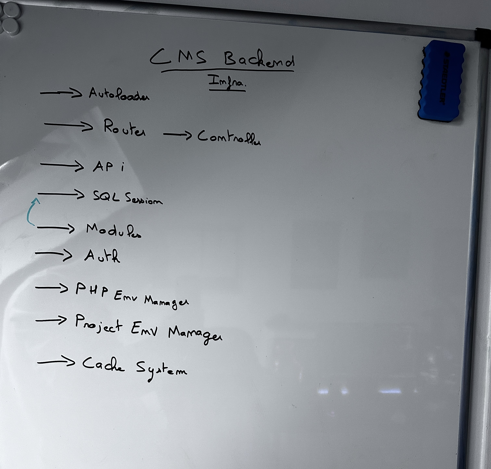

# Aether PHP
POO embedded, fast and lightweight CMS written in PHP 8.

Project started. Under development...

Goal : make a simple, lightweight and efficient PHP CMS to avoid heavy and useless as hell frameworks.  
-> POO oriented infrastructure to make the CMS easy to embed in full projects (frontend integration)  
-> Long term goals : use an extended version of this CMS for my freelance missions

-> Documented creation. The goal is to write every thing that i am thinking and to provide pictures of the webapp creation/design process.

